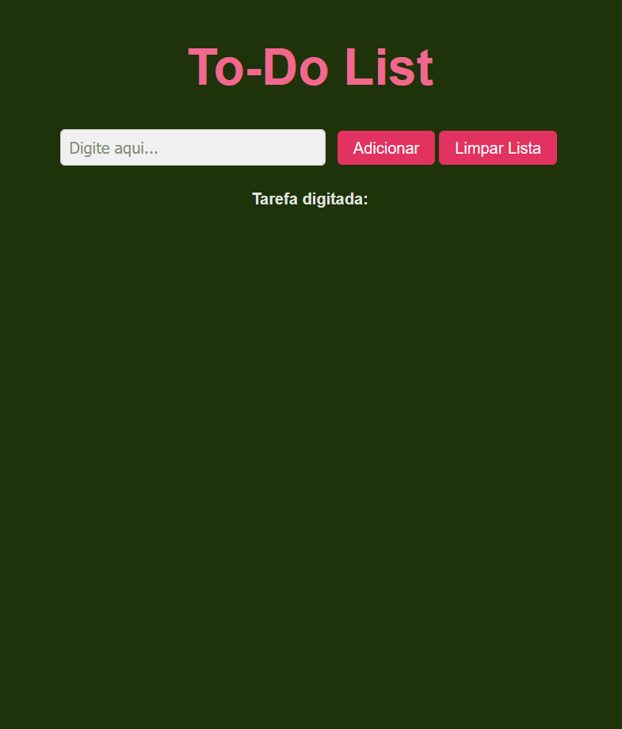
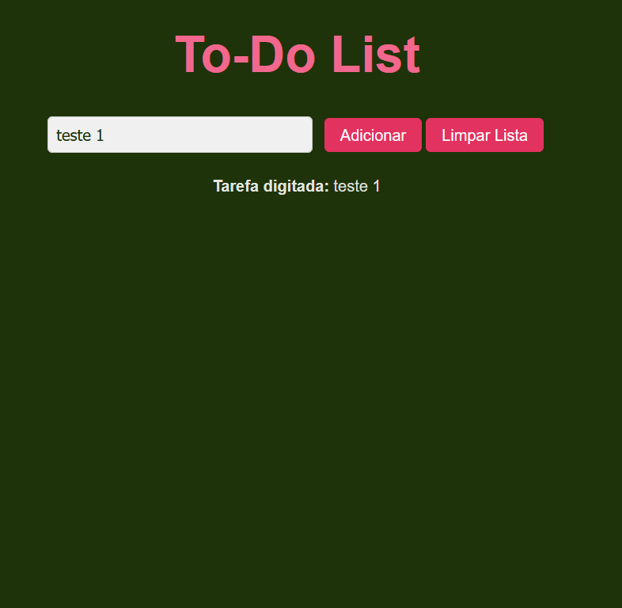
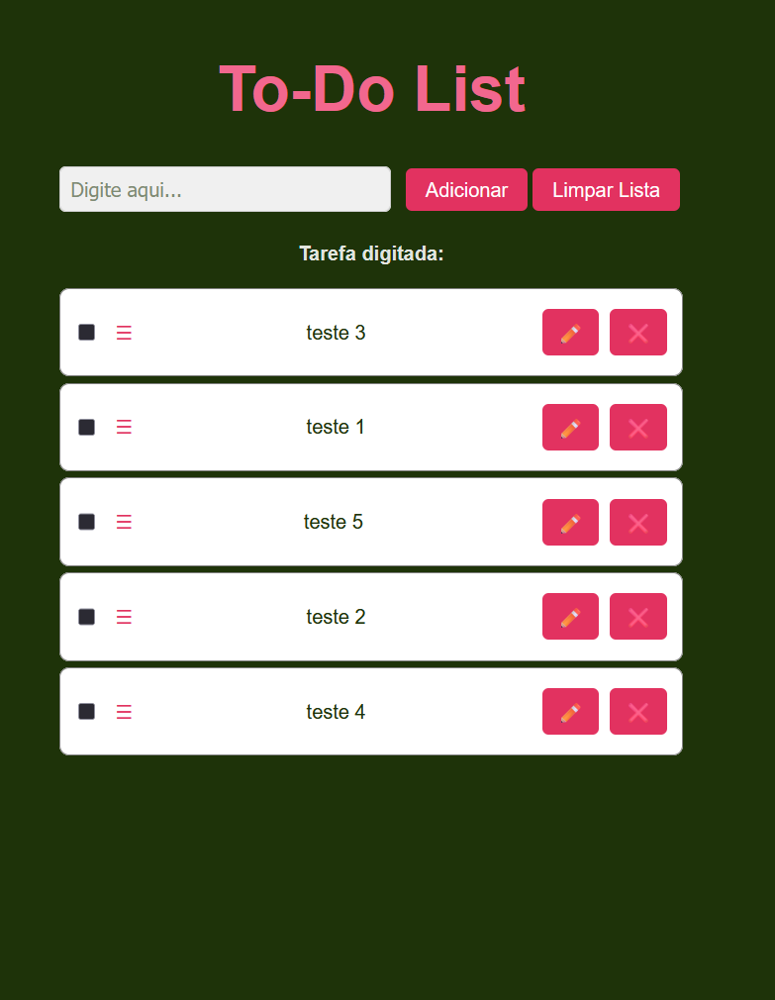
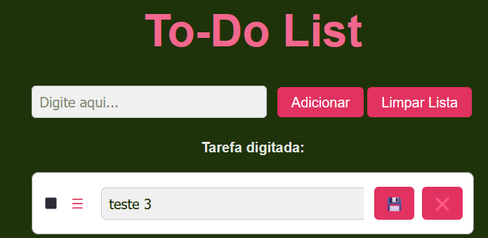
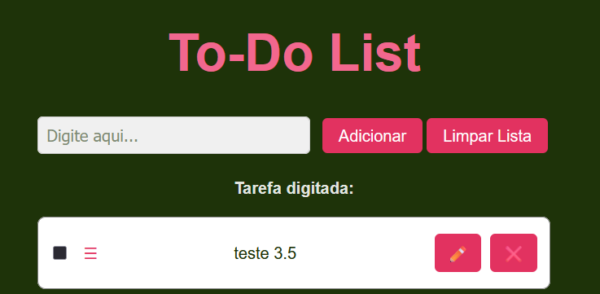
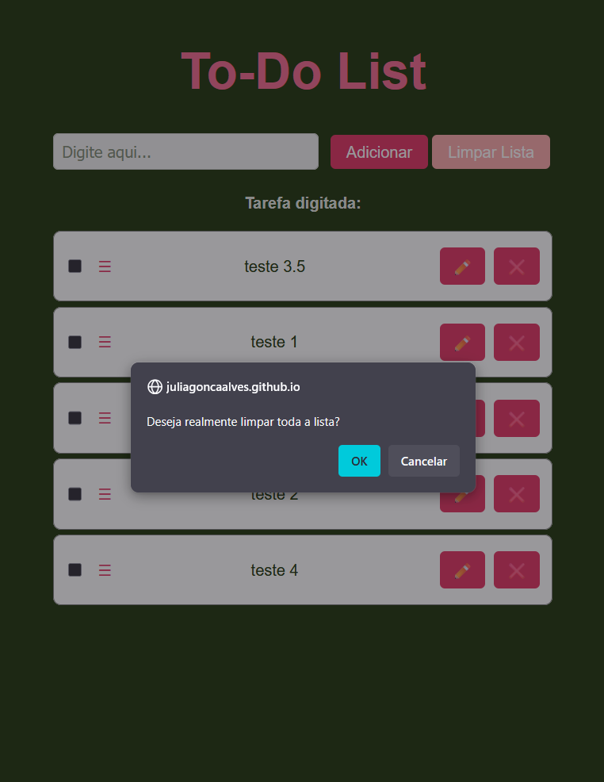
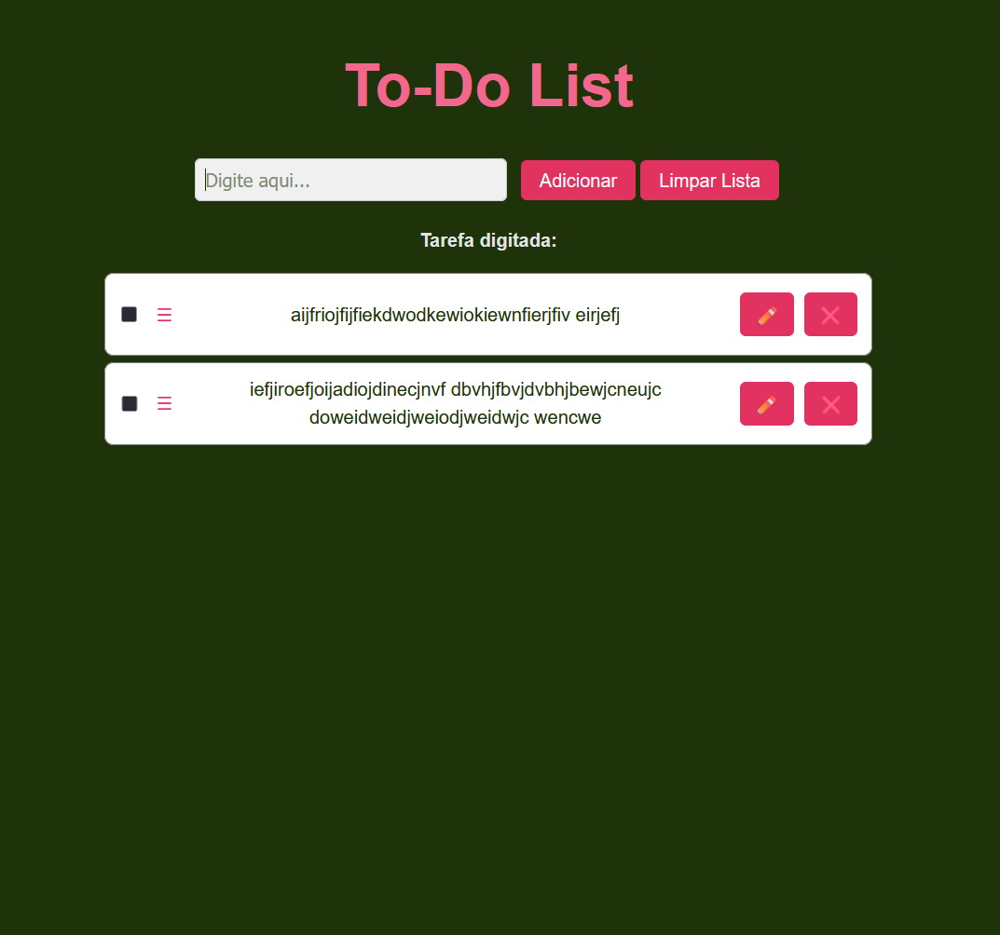

# 📝 To-Do List com React

Um projeto simples de lista de tarefas desenvolvido com **React + Vite**, permitindo adicionar, editar, marcar e remover tarefas.  
O deploy foi feito utilizando o **GitHub Pages**.

---

## 🚀 Demonstração

🔗 [Acesse o projeto online](https://juliagoncaalves.github.io/to-do-list-react/)

---

## 📌 Funcionalidades

- ➕ Adicionar novas tarefas  
- ✏️ Editar tarefas existentes  
- ✅ Marcar/desmarcar como concluídas  
- ❌ Excluir tarefas  
- 💾 Persistência no navegador (localStorage)

---

## 🛠️ Tecnologias Utilizadas

- [React](https://react.dev/)  
- [Vite](https://vitejs.dev/)  
- [JavaScript (ES6+)](https://developer.mozilla.org/pt-BR/docs/Web/JavaScript)  
- [CSS](https://developer.mozilla.org/pt-BR/docs/Web/CSS)  

---

## 📸 Prints da Aplicação

## Tela Inicial 


## Tela Input


## Tela Lista


## Tela Lista Alternada



## Tela Editar


## Tela Salvar


## Tela Limpar Lista Completa


## Tela Card Responsivo


## 📂 Estrutura de Pastas

```bash
to-do-list-react/
│── public/          
│── src/               
│   ├── App.jsx     
│   ├── main.jsx    
│── .gitignore
│── index.html
│── package.json
│── vite.config.js   
│── README.md
```

---

## ⚙️ Como Rodar Localmente

Clone o repositório:

```bash
git clone https://github.com/juliagoncaalves/to-do-list-react.git
```

Acesse a pasta do projeto:

```bash
cd to-do-list-react
```

Instale as dependências:

```bash
npm install
```

Rode o servidor de desenvolvimento:

```bash
npm run dev
```

Abra no navegador:

```bash
http://localhost/
```

## 🌐 Deploy no GitHub Pages

O projeto já está configurado para GitHub Pages.
Para fazer o deploy, siga os passos abaixo:

Gere o build de produção:

```bash
npm run build
```

Publique no GitHub Pages:

```bash
npm run deploy
```

Após alguns minutos, o site estará disponível em:
https://juliagoncaalves.github.io/to-do-list-react/

## 👩‍💻 Autora

Feito por Júlia Gonçalves do Carmo Silva

🔗 [LinkedIn](https://www.linkedin.com/in/juliagoncaalves/)

🔗 [Portfólio](https://github.com/juliagoncaalves)
